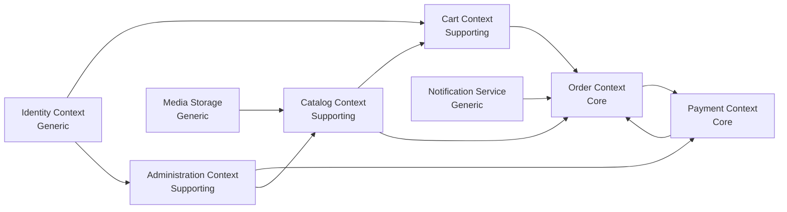

# Online Shop Model-Driven Design

## 1. Domain Vision
The Online Shop domain enables customers to discover products, place orders, and pay securely while enabling administrators to manage catalog, orders, and settlement settings.

## 2. Domain Drivers
- Fast and reliable checkout flow
- Clear payment status and traceability
- Maintainable product catalog management
- Auditability for order lifecycle and payment confirmation

## 3. Ubiquitous Language
- Customer: A user who browses and buys products.
- Admin: A user who manages products, bank settings, and orders.
- Product: Sellable item with price and category.
- Cart: Temporary collection of products selected by a customer.
- Order: Customer purchase request created from a cart snapshot.
- Payment Method: Card, wallet, or bank transfer option.
- Payment Reference: Unique reference for transfer reconciliation.
- Review: Customer feedback for a product.
- Settlement Account: Merchant bank account used for receiving transfers.

## 4. Subdomains

### 4.1 Core Subdomain
Core business capabilities that differentiate this shop implementation.

- Checkout and Order Lifecycle
  - Responsibilities: Validate order intent, create order, set initial payment state, transition order states.
  - Why core: It directly shapes customer conversion and revenue realization.

- Payment Orchestration and Reconciliation
  - Responsibilities: Handle payment method rules, generate references, mark payment status (`pending`, `paid`), reconcile bank transfer confirmations.
  - Why core: It controls correctness and trust of transaction outcomes.

### 4.2 Supporting Subdomains
Important capabilities that enable the core but are not differentiators.

- Product Catalog Management
  - Product creation/update, categorization, image metadata handling.

- Customer Shopping Experience
  - Browse/search/filter interactions and product detail presentation.

- Review Management
  - Capture and retrieve product ratings/comments.

- Admin Operations
  - Manage products, orders, and settlement account configuration.

### 4.3 Generic Subdomains
Commodity capabilities often reused across systems.

- Authentication and Session
  - User login, role checks (`admin`, `user`), session persistence.

- Notification/Email Dispatch
  - Confirmation messages and fallback persistence.

- File/Media Storage
  - Product image storage and retrieval.

- UI Component Framework
  - Shared controls, dialogs, tabs, toasts, and styling system.

## 5. Bounded Contexts

1. Catalog Context
- Aggregates: `Product`
- Entities: `Product`, `ProductReview`
- Value Objects: `Price`, `Category`, `ImageUrl`, `Rating`
- Domain Services: `CatalogQueryService`
- Key Commands: `CreateProduct`, `UpdateProduct`, `SubmitReview`
- Key Events: `ProductCreated`, `ProductUpdated`, `ReviewSubmitted`

2. Cart Context
- Aggregates: `Cart`
- Entities: `Cart`, `CartItem`
- Value Objects: `Quantity`
- Domain Services: `CartPricingService`
- Key Commands: `AddItemToCart`, `UpdateCartItemQuantity`, `RemoveCartItem`
- Key Events: `CartItemAdded`, `CartItemQuantityUpdated`, `CartItemRemoved`

3. Order Context
- Aggregates: `Order`
- Entities: `Order`, `OrderLine`
- Value Objects: `OrderId`, `OrderStatus`, `Money`, `CustomerInfo`, `DeliveryInfo`
- Domain Services: `OrderPlacementService`
- Key Commands: `PlaceOrder`, `MarkOrderPaid`, `MarkOrderPending`
- Key Events: `OrderPlaced`, `OrderPaymentStatusChanged`

4. Payment Context
- Aggregates: `Payment`
- Entities: `PaymentTransaction`
- Value Objects: `PaymentMethod`, `PaymentReference`, `PaymentStatus`
- Domain Services: `PaymentOrchestrationService`, `TransferReconciliationService`
- Key Commands: `InitiatePayment`, `GenerateTransferReference`, `ConfirmBankTransfer`
- Key Events: `PaymentInitiated`, `TransferReferenceGenerated`, `PaymentConfirmed`

5. Administration Context
- Aggregates: `SettlementAccount`
- Entities: `SettlementAccount`, `AdminAction`
- Value Objects: `IBAN`, `AccountHolderName`, `BankName`
- Domain Services: `BankSettingsService`, `AdminAuthorizationService`
- Key Commands: `ConfigureSettlementAccount`, `ChangeOrderStatus`
- Key Events: `SettlementAccountConfigured`, `OrderStatusChangedByAdmin`

6. Identity Context (Generic)
- Aggregates: `UserSession`
- Entities: `User`
- Value Objects: `Role`, `Username`
- Domain Services: `AuthenticationService`
- Key Commands: `Login`, `Logout`
- Key Events: `UserAuthenticated`, `UserLoggedOut`

## 6. Context Relationships

## 7. Aggregate Invariants

- Product
  - `price > 0`
  - `name` is required and non-empty

- Cart
  - Quantity for each `CartItem >= 1`
  - No duplicate `productId` rows in same cart

- Order
  - Order must contain at least one order line
  - Final order total equals sum of line totals
  - Payment status transitions must be valid (`pending -> paid` allowed)

- SettlementAccount
  - IBAN must pass validation before activation

## 8. Application Service Layer (Recommended)
- `CatalogAppService`
- `CartAppService`
- `CheckoutAppService`
- `PaymentAppService`
- `AdminAppService`

Each service orchestrates use cases and delegates business rules to domain objects/services.

## 9. Suggested Module Mapping
- `src/domain/catalog/*`
- `src/domain/cart/*`
- `src/domain/order/*`
- `src/domain/payment/*`
- `src/domain/admin/*`
- `src/domain/identity/*`
- `src/application/*`
- `src/infrastructure/*`

This structure allows gradual migration from component-centric code to explicit model-driven architecture.
